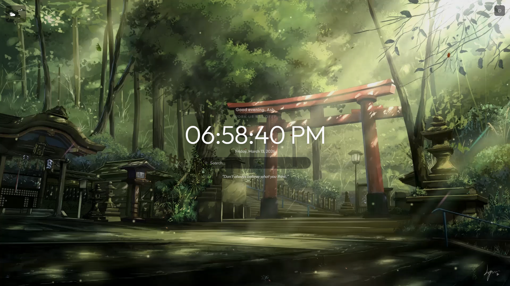
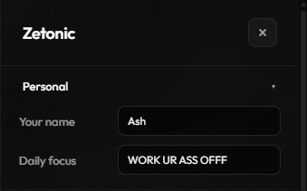
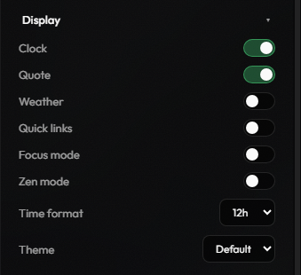
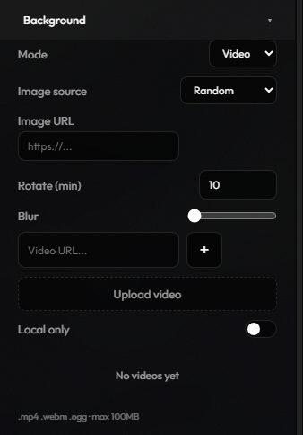
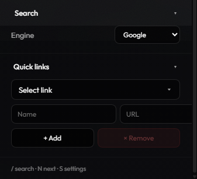

# zetonic previews 📸

a quick look at your new aesthetic workspace.

 

### 🌿 the dashboard
*clean, bold, and minimal. everything you need at a glance.* 

  

###  personalize your space
*set your name, your daily focus, and choose your vibe.* 

  

###  total control
*toggle exactly what you want to see. zero clutter.* 

  

###  dynamic backgrounds
*curated loops or your own local media uploads.* 

  

###  quick links
*your favorite spots on the internet, just one click away.* 

  

<small><a href="README.md">← back to readme</a></small>

